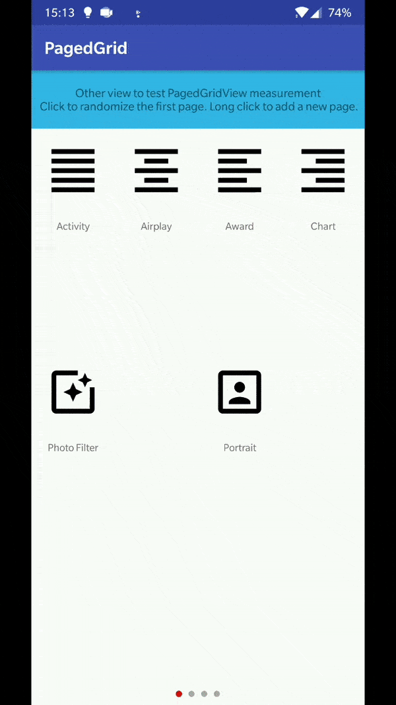
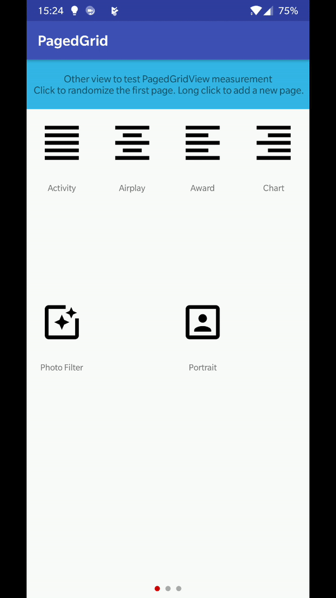
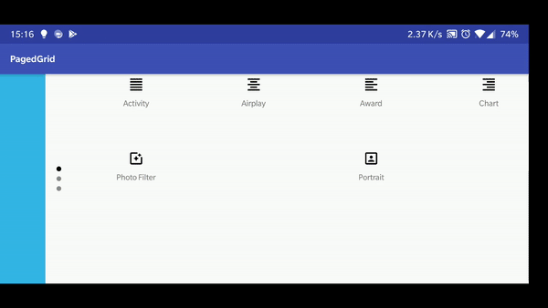

[  ](https://bintray.com/arabello/android/pagedgrid/_latestVersion)
[](https://android-arsenal.com/api?level=16)

# PagedGrid

A `PagedGrid` is a `ViewPager` which pages are `GridLayout` with equal distributed rows and columns. 
This project is an Android library, written in Kotlin, that helps you create a `PagedGrid` component and manage its pages and cell views.

### Motivation

This module provides a component with no added features, but a simple way to rapidly create particular
Android views reducing the complexity, for example control panels, launchers and tables.




## Getting started

[  ](https://bintray.com/arabello/android/pagedgrid/_latestVersion)

Add the module as dependency using the latest version number, specified above.

```groovy
dependencies {
    implementation 'io.matteopellegrino:pagedgrid:x.x.x'
}
```

## Usage
Notation: (ColumnIndex, RowIndex)  [ColumnIndex, RowIndex]

Add the custom view to your layout

```xml
<io.matteopellegrino.pagedgrid.PagedGridView
    android:id="@+id/pagedGridView"
    android:layout_width="match_parent"
    android:layout_height="match_parent"/>
```

Assign an instance of `GridAdapter` to the `PagedGrid`

```kotlin
val gridAdapter = GridAdapter(arrayOf())
pagedGridView.adapter = gridAdapter
```

Create an `EmptyGrid` page, specifying the number of columns and rows

```kotlin
val page1 = EmptyGrid(4, 5)
```

The page (grid) is a matrix of `Element` interface. 
`DrawableIcon` and `BitmapIcon` are ready to use implementation of `Element`.
Add an element to the page using column and rows indexes.

```kotlin
page1[0, 2] = DrawableIcon("Photo Filter", R.drawable.ic_photo_filter_black_24dp)
page1[2, 2] = DrawableIcon("Portrait", R.drawable.ic_portrait_black_24dp)
```

You can create your own element just extending `AbstractElement`.

```kotlin
page1[1, 1] = object : AbstractElement() {
    override fun inflateView(parent: ViewGroup): View {
        val layout = LayoutInflater.from(parent.context).inflate(R.layout.custom, null)
        val img = layout.findViewById(R.id.img)
        val txt = layout.findViewById(R.id.txt)
        img.scaleType = ImageView.ScaleType.CENTER_CROP
        img.setImageBitmap(BitmapFactory.decodeResource(resources, R.mipmap.img_4))
        txt.setText(R.string.mytext)
        return layout
    }
}
```

Once pages are ready, add them (or assign) to the adapter and notify the changes.

```kotlin
gridAdapter.pages += page1
gridAdapter.notifyDataSetChanged()
```

The method `setOnInflateViewListener` allows you to access the cell `View` when created, extremely
useful for attaching Android events.
You can easily iterate over pages and cells (elements) as showed below.

```kotlin
gridAdapter.pages.forEach { page ->
    page.forEachIndexed { x, y, elem ->

        elem.setOnInflateViewListener { view ->
            view.setOnClickListener {
                Toast.makeText(baseContext, "View on ($x, $y) clicked", Toast.LENGTH_SHORT).show()
            }
        }
    }
}
```

For further details and specific uses case, please see the [sample app](https://github.com/arabello/PagedGrid/blob/master/sample/src/main/java/io/matteopellegrino/pagedgrid/sample/MainActivity.kt)

## Personalization

Here the personalization properties (first value as default)

```xml
 <io.matteopellegrino.pagedgrid.PagedGridView
        app:animationEnabled="true|false"
        app:orientation="portrait|landscape"
        app:pageIndicatorUnselected="@android:color/gray"
        app:pageIndicatorSelected="@android:color/black" />
```

### Animation
When the content of a page change and it is currently displayed, the component animates
the transition to the new content as showed below.



### Landscape

The landscape mode is supported, but it is severely rigid. 
The component is rotated **clockwise only** and the scroll becomes vertical. In this way


*the coordinate of each element related to a page remain the same considering
the top-left corner as the origin (0,0)* 




## Credits
Third party dependencies. Thanks to

- [PageIndicatorView](https://github.com/romandanylyk/PageIndicatorView)


## License

    MIT License
       
    Copyright (c) 2018 Matteo Pellegrino
        
    Permission is hereby granted, free of charge, to any person obtaining a copy
    of this software and associated documentation files (the "Software"), to deal
    in the Software without restriction, including without limitation the rights
    to use, copy, modify, merge, publish, distribute, sublicense, and/or sell
    copies of the Software, and to permit persons to whom the Software is
    furnished to do so, subject to the following conditions:
        
    The above copyright notice and this permission notice shall be included in all
    copies or substantial portions of the Software.
        
    THE SOFTWARE IS PROVIDED "AS IS", WITHOUT WARRANTY OF ANY KIND, EXPRESS OR
    IMPLIED, INCLUDING BUT NOT LIMITED TO THE WARRANTIES OF MERCHANTABILITY,
    FITNESS FOR A PARTICULAR PURPOSE AND NONINFRINGEMENT. IN NO EVENT SHALL THE
    AUTHORS OR COPYRIGHT HOLDERS BE LIABLE FOR ANY CLAIM, DAMAGES OR OTHER
    LIABILITY, WHETHER IN AN ACTION OF CONTRACT, TORT OR OTHERWISE, ARISING FROM,
    OUT OF OR IN CONNECTION WITH THE SOFTWARE OR THE USE OR OTHER DEALINGS IN THE
    SOFTWARE.
